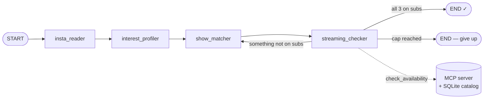

# 🍿 DateNight Show Matcher

A Claude-powered **orchestrator + sub-agents** system that, from a single command,
profiles an Instagram handle and recommends **three date-night TV shows that are
actually available on your streaming subscriptions** (Netflix + HBO — Prime is
ignored, because there's no subscription to it).

Built for the "DateNight Show Matcher" assignment. The CLI is the spec-compliant
deliverable; a polished **React web demo** (dual-mode, deployable to Cloudflare
Pages) is layered on top of the *same* core so the pipeline can be shown off live
or as a self-contained recording.

```
$ get-show @art_girl
🍿 DateNight Show Matcher  [MOCK]   @art_girl
 ● Insta Reader        Read 6 posts · 8 hashtags
 ● Interest Profiler   Built psychographic profile
 ● Show Matcher        3 candidate(s) proposed   (attempt 2 after a re-pick)
 ● Streaming Checker   2/3 available on your subscriptions
 → #1 The White Lotus (2021)   watch on  HBO
 → #2 Normal People (2020)     watch on  HBO
 → #3 Sex Education (2019)     watch on  NETFLIX
 ✗ Fleabag — only on prime (not subscribed)
```

---

> 📐 **Architecture deep-dive (diagrams + rationale):** [docs/architecture.md](docs/architecture.md)

## How it maps to the assignment

| Assignment role | Here | Model tier |
|---|---|---|
| **Agent-Coordinator (Orchestrator)** | `app/graph/pipeline.py` — a **LangGraph** `StateGraph` that sequences the sub-agents, passes JSON context, runs the re-pick loop, and streams progress | — |
| **#1 Insta Reader** | `app/agents/insta_reader.py` — returns a pre-baked profile dump (no scraping, per the brief); optional Haiku normalisation | fast (Haiku) |
| **#2 Interest Profiler** | `app/agents/interest_profiler.py` — raw text → strict-JSON `InterestProfile` | analysis (Sonnet) |
| **#3 Show Matcher** | `app/agents/show_matcher.py` — psychographic JSON → ranked top-3 with reasoning | analysis (Sonnet) |
| **#4 Streaming Checker** | `app/agents/streaming_checker.py` — a **real MCP tool-use loop**; filters to Netflix/HBO; forces a re-pick when a title isn't on the subs | fast (Haiku) + MCP |

The **MCP server** (`app/mcp_server/server.py`) is a genuine Model Context Protocol
stdio server exposing a `check_availability(title)` tool backed by **SQLite**
(seeded from `app/data/catalog.json`).

### Pipeline flow



The Streaming Checker calls the MCP `check_availability` tool for every candidate.
Anything not on Netflix/HBO is excluded and the Matcher re-picks (capped by
`MAX_REPICKS`). `@art_girl` and `@tech_babe` deliberately trigger one re-pick
(their top pick is Prime-only); `@fitness_jane` and `@bookworm_bella` resolve on
the first attempt.

---

## Real vs. mock — runs with **zero** setup

The analytical agents talk to an `LLMProvider` (`app/llm/provider.py`):

- **`RealProvider`** → the Claude API (Anthropic SDK), using `messages.parse` for
  schema-validated JSON and a tool-use loop for the checker, with prompt caching
  wired on the system prompts.
- **`MockProvider`** → deterministic, scripted outputs (`app/mock_data/fixtures.py`).
  No API key, no network, no cost — and it's what the tests and the web demo's
  recorded fixtures rely on.

`APP_MODE=auto` (default) picks **real** when `ANTHROPIC_API_KEY` is set, otherwise
**mock**. The MCP server + SQLite are used in *both* modes (only the LLM is mocked).

> ⚠️ **Model note (important):** the assignment named
> `claude-3-5-sonnet-20241022` and `claude-3-5-haiku-20241022`. Both were
> **retired by Anthropic** (Oct 2025 / Feb 2026) and now return HTTP 404. This
> project defaults to the current `claude-sonnet-4-6` / `claude-haiku-4-5-20251001`
> and keeps them fully configurable via `MODEL_ANALYSIS` / `MODEL_FAST`.

---

## Project structure

```
datenight-show-matcher/
├── docker-compose.yml          # web (nginx) + backend (uvicorn) — one-command demo
├── Makefile                    # make install | cli | serve | test | up | demo | …
├── .env.example                # all backend config (copy to .env)
├── docs/
│   ├── architecture.md         # component + sequence + state diagrams, design rationale
│   ├── contracts.md            # FROZEN wire contract: SSE PipelineEvent, HTTP API, fixtures
│   └── brand.md                # PlayFix-derived design tokens & a11y/perf bar
├── backend/
│   ├── pyproject.toml          # deps + `get-show` / `datenight` console scripts
│   ├── Dockerfile
│   └── app/
│       ├── config.py           # pydantic-settings: mode, models, platforms, CORS
│       ├── models.py           # contracts: ProfileDump, InterestProfile, ShowMatch,
│       │                       #            Availability, RunResult, PipelineEvent (SSE)
│       ├── cli.py              # Typer + Rich live UI (get-show, serve, seed-db, …)
│       ├── api.py              # FastAPI: /health, /api/profiles, /api/stream (SSE), /api/run
│       ├── graph/pipeline.py   # ← the LangGraph orchestrator + re-pick loop
│       ├── agents/             # the 4 sub-agents + prompts.py
│       ├── llm/                # anthropic_client.py (real) + provider.py (real/mock)
│       ├── mcp_server/         # server.py (FastMCP stdio) + client.py (Anthropic bridge)
│       ├── data_access/        # catalog.py (JSON → SQLite, lookups)
│       ├── data/catalog.json   # mock streaming catalog ("the world")
│       └── mock_data/          # profiles.py (IG dumps) + fixtures.py (scripted LLM output)
│   └── tests/                  # pytest: catalog, provider, MCP+checker, pipeline, API/SSE
└── frontend/                   # React 19 + Vite 8 + TS — see frontend/README.md
    └── src/                    # dual-mode SPA (live SSE ↔ recorded-run replay)
```

---

## Quickstart

**Prerequisites:** Python 3.11+, [bun](https://bun.sh) (or Node 20.19+) for the
frontend, and (optionally) Docker. The repo ships a `.vscode/settings.json` that
auto-selects the backend venv interpreter, so IDE imports resolve out of the box.

### 1) Backend + CLI (the primary deliverable)

```bash
make install-backend          # python venv + editable install (or: see Makefile)
make cli HANDLE=@art_girl      # or: backend/.venv/bin/get-show @art_girl
make info                      # show resolved mode / models / handles
```

Known demo handles: `@art_girl`, `@tech_babe`, `@fitness_jane`, `@bookworm_bella`
(any other handle gets a generic profile). Add `--json` for raw output.

For **real** Claude calls: `cp .env.example .env`, set `ANTHROPIC_API_KEY`, rerun.

### 2) Web demo

```bash
make serve         # FastAPI + SSE on http://localhost:8090   (terminal 1)
make web-dev       # Vite dev server on http://localhost:5173  (terminal 2, proxies /api)
```

### 3) Everything in Docker (one command — great for recording)

```bash
docker compose up --build       # web → http://localhost:8091  (LIVE), backend → :8090
WEB_PORT=9000 docker compose up  # change the web host port
docker compose run --rm backend get-show @tech_babe
```

nginx serves the SPA and reverse-proxies `/api` + `/health` to the backend
(same-origin → no CORS, SSE works through the proxy).

> Needs access to the Docker daemon: either add your user to the `docker` group
> (`sudo usermod -aG docker $USER`, then re-login) or prefix the commands with `sudo`.

---

## Configuration (`.env`)

| Var | Default | Meaning |
|---|---|---|
| `ANTHROPIC_API_KEY` | — | Claude key; absent → offline mock mode |
| `APP_MODE` | `auto` | `auto` / `real` / `mock` |
| `MODEL_ANALYSIS` | `claude-sonnet-4-6` | Profiler + Matcher tier |
| `MODEL_FAST` | `claude-haiku-4-5-20251001` | Insta Reader + Checker tier |
| `MAX_REPICKS` | `3` | re-pick attempts before giving up |
| `USER_PLATFORMS` | `netflix,hbo` | subscriptions to filter on (Prime ignored) |
| `CORS_ORIGINS` | Vite dev origins | allowed browser origins |
| `API_HOST` / `API_PORT` | `0.0.0.0` / `8090` | server bind |

Prompts live in `backend/app/agents/prompts.py` (the Profiler prompt mirrors the
one in the assignment). The full wire contract is in `docs/contracts.md`.

---

## Tests

```bash
make test          # pytest: catalog/SQLite, mock provider, real MCP tool + checker,
                   #         the LangGraph re-pick loop, and the FastAPI/SSE surface
make lint          # ruff
```

24 backend tests cover the behaviour end-to-end (no key required) — including the
real-mode code paths (`parse_json`, the tool-use loop, `RealProvider`, the real-mode
Streaming Checker) exercised against a stubbed Anthropic client + the live MCP server.
The frontend is verified via `bun run build` + `tsc --noEmit` (see `frontend/README.md`).

---

## Deploying the frontend to Cloudflare Pages (free)

The SPA is **dual-mode**: with a reachable backend it streams live; with none
(e.g. on Pages) it auto-falls back to replaying bundled recorded runs — so it
works standalone from anywhere.

- **Build command:** `bun run build` (or `npm run build`) · **Output dir:** `dist`
- **Root directory:** `frontend`
- Leave `VITE_API_BASE` **unset** → the deployed site runs in demo mode.
- Regenerate recordings anytime with `make fixtures` (writes `frontend/src/demo/*.json`).

---

## Notes & non-goals

- **No real Instagram scraping** — mocked by design (per the brief's FAQ).
- The streaming catalog is **mock data**, not real licensing.
- The orchestrator is hand-mappable to CrewAI/n8n; LangGraph was chosen for an
  explicit, inspectable state machine with a conditional loop.
- Prompt caching is wired but our prompts are below the model's minimum cacheable
  prefix, so it's currently a no-op that activates as prompts grow (noted in code).
```
