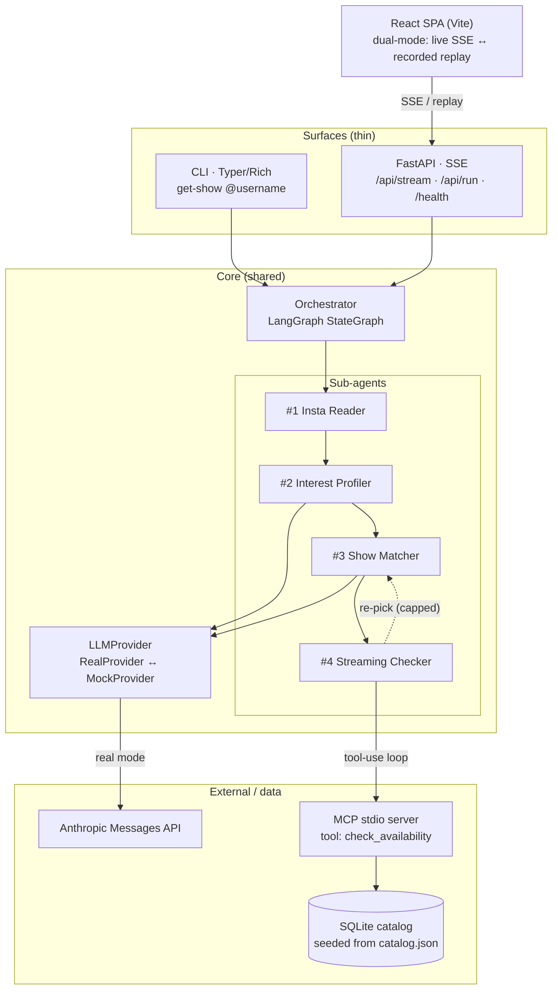
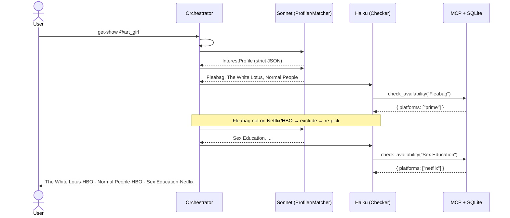
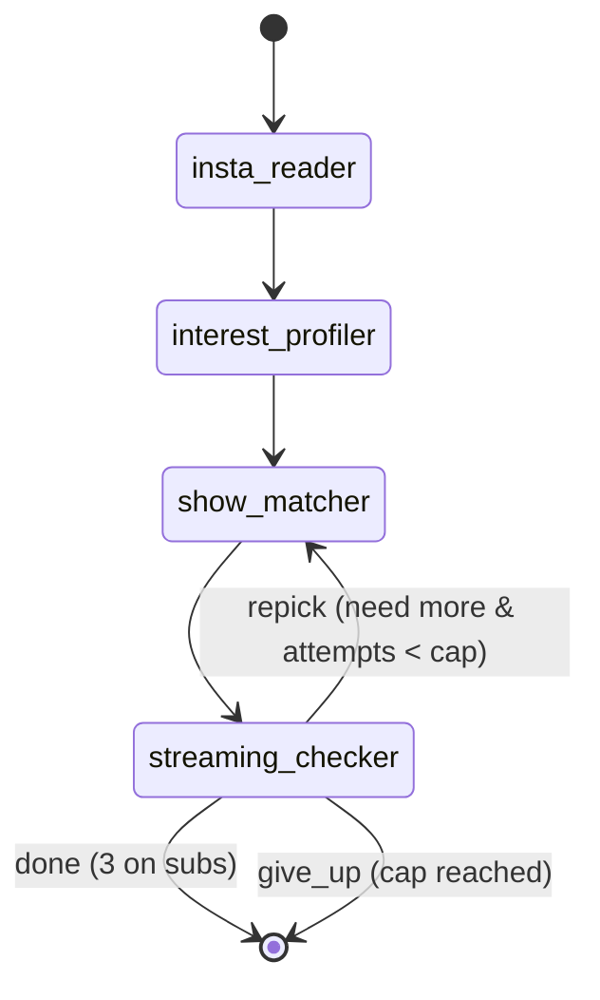

# Architecture

How DateNight Show Matcher is built. For *running* it see the [README](../README.md);
for the exact wire types see [contracts.md](contracts.md).

## The core idea: one brain, two surfaces

`backend/app/graph/pipeline.py::run_pipeline()` is the entire orchestration. The **CLI**
and the **FastAPI/SSE** endpoint are just two renderers of the same `PipelineEvent` stream,
so they can never drift. The web demo replays *recorded* versions of that same stream.

## Components

- **Surfaces are thin.** They translate input → `run_pipeline(handle)` and render the event stream.
- **Agents talk to an `LLMProvider`**, not to the SDK directly — so the same graph runs against the
  real API or a deterministic mock. Only the LLM is swapped; the MCP server + SQLite run in **both** modes.
- **The Streaming Checker** is the function-calling showcase: it drives the MCP `check_availability`
  tool. Availability is then computed **in code** from the tool's return — never trusted to the model.

## A run, step by step

The conditional **re-pick loop** is why this is a `StateGraph` and not three `await`s: the
checker's edge routes back to the matcher (passing excluded titles as off-limits), bounded by
`MAX_REPICKS` + LangGraph's `recursion_limit`. Picks accumulate across attempts; if it can't fill
three on the user's subscriptions it ends gracefully with 0–3.

## Pipeline state machine

## Data contracts

Typed pydantic models flow between nodes (source of truth: `backend/app/models.py`, mirrored in
`frontend/src/types.ts` and documented in [contracts.md](contracts.md)):

`ProfileDump` → `InterestProfile` → `ShowCandidate[]` → `Availability[]` → `RunResult`, with a
`PipelineEvent` envelope (`seq`, `elapsed_ms`, `stage`, `event`, `data`) streamed over SSE and
stored verbatim in the demo fixtures.

## Real vs. mock

`APP_MODE=auto` (default) → **real** when `ANTHROPIC_API_KEY` is set, else **mock**.

| | Real | Mock |
|---|---|---|
| Profiler / Matcher | Anthropic `messages.parse` (schema-validated JSON) | scripted fixtures per handle |
| Streaming Checker | Anthropic tool-use loop → MCP | direct MCP call (no LLM) |
| MCP server + SQLite | ✅ used | ✅ used |
| Model tiers | Sonnet (analysis) · Haiku (fast) | — |

## Why these choices

- **Orchestrator + sub-agents** — separation of concerns and cost control (Haiku for routine
  parse/checks, Sonnet for analysis), exactly as the brief frames it.
- **LangGraph** — an explicit, inspectable state machine with a *conditional loop* and built-in
  streaming; maps cleanly onto CrewAI / n8n if needed.
- **A real MCP server** — isolates the external-availability boundary behind a tool the model calls
  (genuine function calling), the pattern the role centres on. The Anthropic MCP *connector* only
  speaks to remote HTTPS servers, so a local **stdio** server uses a manual client→tool bridge.
- **Structured outputs** (`messages.parse` + pydantic) — guaranteed-valid JSON, no fragile parsing.
- **Ground-truth in code** — the user-subscription filter (Netflix/HBO; Prime ignored) is applied
  to the MCP tool's data, so a hallucinated title simply comes back unavailable and is re-picked.
- **Dual-mode frontend** — deploys to Cloudflare Pages with no backend (replays bundled runs) or
  streams live SSE locally; same event contract either way.

## Tech stack

Python 3.12 · LangGraph 1.2 · MCP SDK 1.27 · Anthropic SDK 0.105 · FastAPI 0.136 + sse-starlette ·
Typer/Rich · pydantic v2. Frontend: React 19 · Vite 8 · TypeScript. Packaging: Docker Compose
(uvicorn backend + nginx web), 24 pytest tests, ruff.
